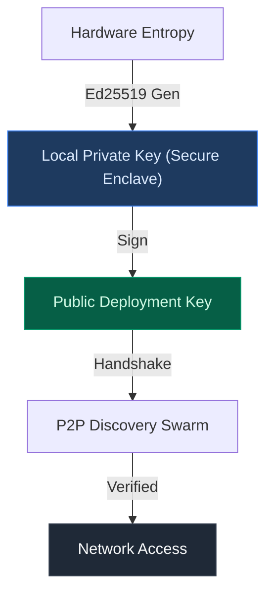

<div align="center">

<br/>

```
██╗    ██╗ ██████╗ ██████╗ ██╗     ██████╗ ██╗   ██╗██████╗ ███╗   ██╗
██║    ██║██╔═══██╗██╔══██╗██║     ██╔══██╗██║   ██║██╔══██╗████╗  ██║
██║ █╗ ██║██║   ██║██████╔╝██║     ██║  ██║██║   ██║██████╔╝██╔██╗ ██║
██║███╗██║██║   ██║██╔══██╗██║     ██║  ██║╚██╗ ██╔╝██╔═══╝ ██║╚██╗██║
╚███╔███╔╝╚██████╔╝██║  ██║███████╗██████╔╝ ╚████╔╝ ██║     ██║ ╚████║
 ╚══╝╚══╝  ╚═════╝ ╚═╝  ╚═╝╚══════╝╚═════╝   ╚═══╝  ╚═╝     ╚═╝  ╚═══╝
```

**WorldVPN — Radical Anonymity via Decentralized P2P Infrastructure**

<br/>


<br/>

</div>

---

> **WorldVPN redefines digital privacy.**
> It provides a decentralized, peer-to-peer VPN ecosystem where identity is cryptographic, logs are non-existent, and the network is powered by its community.

---

## Overview

Traditional VPNs create central points of failure and trust. WorldVPN eliminates these risks by utilizing a **P2P Hybrid architecture**. By securely connecting users through a decentralized swarm and utilizing memory-safe Rust for its core, WorldVPN ensures your traffic remains your business.

### Core Pillars

- **🛡️ Radical Anonymity**: No emails, no passwords. Identity is persistent via local Ed25519 key-pairs stored in hardware keystores.
- **🌐 Decentralized Discovery**: Powered by `libp2p` (Kademlia DHT, Gossipsub). Nodes discover each other without central trackers.
- **⚡ Multi-Protocol Core**: Unified Rust engine supporting WireGuard, Hysteria2, VLESS, and ShadowSocks.
- **♻️ Zero-Log by Design**: Backend handles only ephemeral sessions with TTL-based pruning (24h). All metadata is encrypted.
- **💎 Ethical Economy**: Share your bandwidth to act as a community node and earn credits within the ecosystem.

---

## Architecture

WorldVPN is a modular three-layer stack designed for high throughput and absolute privacy.

```
┌─────────────────────────────────────────────────────────┐
│                    WORLDVPN CLIENT                      │
│             Tauri (Desktop) · Flutter (Mobile)          │
│          Premium UI · Glassmorphism · Real-time         │
└──────────────────────┬──────────────────────────────────┘
                       │  REST / gRPC Bridge
┌──────────────────────▼──────────────────────────────────┐
│                   WORLDVPN BACKEND                      │
│               Rust (Axum) · PostgreSQL                  │
│   Bootstrap · Node Discovery · Credit Manager · TTL      │
└─────────┬────────────────────────────┬──────────────────┘
          │  libp2p (Gossipsub)        │  End-to-End Tunnel
┌─────────▼────────────┐   ┌──────────▼──────────────────┐
│    COMMUNITY NODES   │   │      PUBLIC RELAYS          │
│  User Shared Uplinks │   │  High-bandwidth Exit Nodes  │
│  Earn Credits (P2P)  │   │  WireGuard · Hysteria2      │
└──────────────────────┘   └─────────────────────────────┘
```

| Component        | Language      | Role                                                                 |
| ---------------- | ------------- | -------------------------------------------------------------------- |
| **vpn-core**     | Rust          | Encryption, Tunnel management, libp2p swarm, Identity derivation     |
| **vpn-server**   | Rust (Axum)   | Orchestration, API, Postgres index (dbmate), Credit accounting       |
| **worldvpn-gui** | Tauri + React | Premium desktop interface, real-time telemetry, glassmorphism        |
| **worldvpn-mob** | Flutter       | Mobile application for Android & iOS (Hardware Keystore integration) |

---

## The Identity Pipeline

Identity in WorldVPN is mathematical, not personal.



**Key properties:**
- **Non-PII** — No user data (Name, Email, IP) is ever linked to your identity.
- **Persistent** — Your reputation and credits follow your key-pair across sessions.
- **Hardware-Backed** — Keys are stored in the device's secure element whenever available.

---

## Security Model

WorldVPN assumes the network environment is **hostile**.

| Property                     | Implementation                                                                           |
| ---------------------------- | ---------------------------------------------------------------------------------------- |
| **Zero-Knowledge**           | Backend only sees encrypted identity hashes — never your actual traffic or keys.         |
| **Ephemeral Sessions**       | Sessions and tokens are automatically purged via PostgreSQL TTL workers after 24 hours.  |
| **Authenticated P2P**        | Every node discovery handshake is signed via Ed25519 to prevent impersonation.            |
| **End-to-End Encryption**    | Traffic is encapsulated in WireGuard or Hysteria2 tunnels from client to exit node.      |

---

## Quick Start

### Prerequisites
- [Rust](https://rustup.rs/) (latest stable)
- [Node.js](https://nodejs.org/) & [Bun](https://bun.sh/) (for Desktop GUI)
- [Flutter](https://flutter.dev/) (for Mobile)

### Build & Run
```bash
# Clone the infrastructure
git clone https://github.com/KOUSSEMON-Aurel/WorldVPN.git
cd WorldVPN

# Generate internal certificates
./scripts/generate-dev-certs.sh

# Run the backend (requires Database)
cd backend/server && cargo run

# Launch Desktop Client
cd frontend/worldvpn-gui && bun tauri dev
```

---

## Project Structure

```
WorldVPN/
├── crates/
│   └── vpn-core/        # Rust — P2P logic, Tunneling, Cryptography
├── backend/
│   └── server/          # Rust — Axum API, Credit management, Migrations
├── frontend/
│   ├── worldvpn-gui/    # Tauri + React — Desktop App
│   └── worldvpn-mobile/ # Flutter — Android/iOS App
└── scripts/             # Dev-ops and Certificate management
```

---

## Roadmap

- [x] **Phase 1**: Shared Rust core & WireGuard integration.
- [x] **Phase 2**: Ed25519 Identity & libp2p Swarm discovery.
- [x] **Phase 3**: Standalone OS Daemon & P2P Super-Node relaying.
- [/] **Phase 4**: Anonymous Credit Migration & E2E Endpoint Encryption.
- [ ] **Phase 5**: Multi-Protocol Tunneling & Core Stabilization.

---

<div align="center">

**WorldVPN** · Decentralized Privacy Infrastructure

*Private. Anonyme. Incompressible.*


</div>
