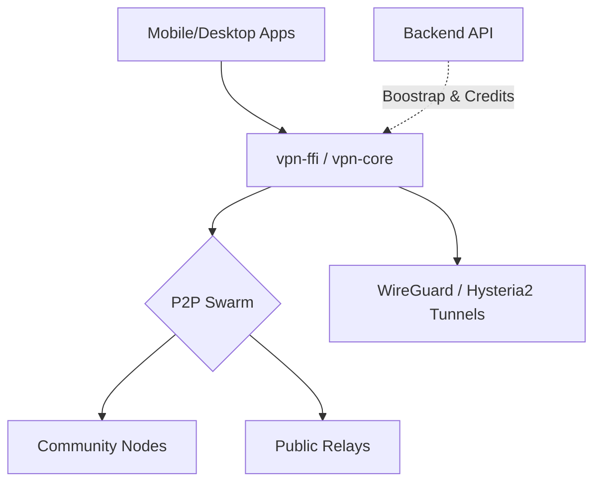

# WorldVPN — Decentralized P2P Infrastructure

<div align="center">
  
  
  
  
</div>

---

**WorldVPN** is a next-generation VPN ecosystem built on radical anonymity and decentralization. Unlike traditional VPNs, WorldVPN eliminates central points of failure and surveillance by utilizing a peer-to-peer (P2P) network and a strict identity-based, non-PII authentication system.

## 🌟 Core Pillars

- **🛡️ Radical Anonymity**: No emails, no passwords. Identity is persistent via local Ed25519 key-pairs. 
- **🌐 Decentralized Discovery**: Powered by `libp2p` (Kademlia DHT, Gossipsub). Nodes discover each other without central trackers.
- **⚡ Multi-Protocol Core**: Unified Rust engine supporting WireGuard, Hysteria2, VLESS, and ShadowSocks.
- **♻️ Zero-Log by Design**: Backend handles only ephemeral sessions with TTL-based pruning. All traffic data is encrypted End-to-End.
- **💎 Ethical Sharing**: Users can share their bandwidth to act as community nodes and earn credits.

---

## 🏗️ Architecture

WorldVPN is organized as a modular Rust workspace:



- **`crates/vpn-core`**: The heart of the system. Handles P2P gossip, identity, and tunnel management.
- **`backend/server`**: Zero-Log coordinator for bootstrapping and credit accounting.
- **`frontend/worldvpn-mobile`**: Cross-platform Flutter app (Android/iOS).
- **`frontend/worldvpn-gui`**: Premium Desktop client built with Tauri (React + Rust).

---

## 🚀 Quick Start

### 1. Requirements
- Rust (latest stable)
- Node.js & Bun (for Desktop GUI)
- Flutter (for Mobile)

### 2. Initial Setup
Generate development certificates and configuration:
```bash
./scripts/generate-dev-certs.sh
```

### 3. Build & Run
```bash
# Build the entire workspace
cargo build --release

# Run the API Server
cargo run -p vpn-server

# Run the Desktop GUI (Dev)
cd frontend/worldvpn-gui && bun tauri dev
```

---

## 🔒 Security Policy

- **Anonymous Identity**: Private keys never leave your device. They are stored in the OS-level Hardware Keystore/Keychain.
- **Ephemeral Sessions**: Anonymous accounts and session records are automatically pruned after 24 hours of inactivity.
- **Encrypted Metadata**: Node endpoints are encrypted and only accessible via Proof-of-Identity handshakes.

---

## 🗺️ Roadmap

- [x] **Phase 1**: shared Rust core & WireGuard integration.
- [x] **Phase 2**: Ed25519 Identity & libp2p Swarm discovery.
- [ ] **Phase 3**: Standalone OS Daemon & P2P Super-Node relaying.
- [ ] **Phase 4**: Fully decentralized credit marketplace (Tokenomics).

---

## 📜 License

This project is licensed under the MIT License.
